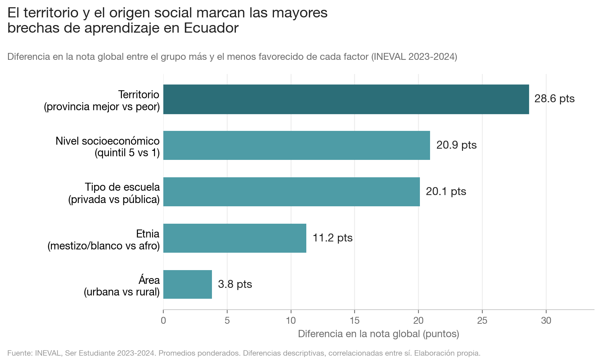
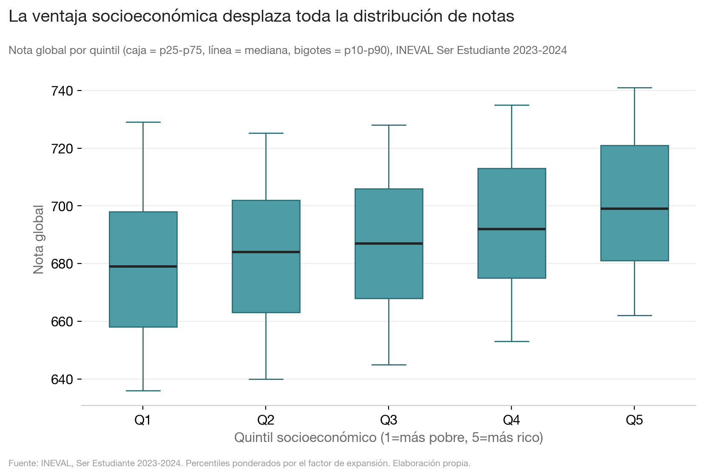
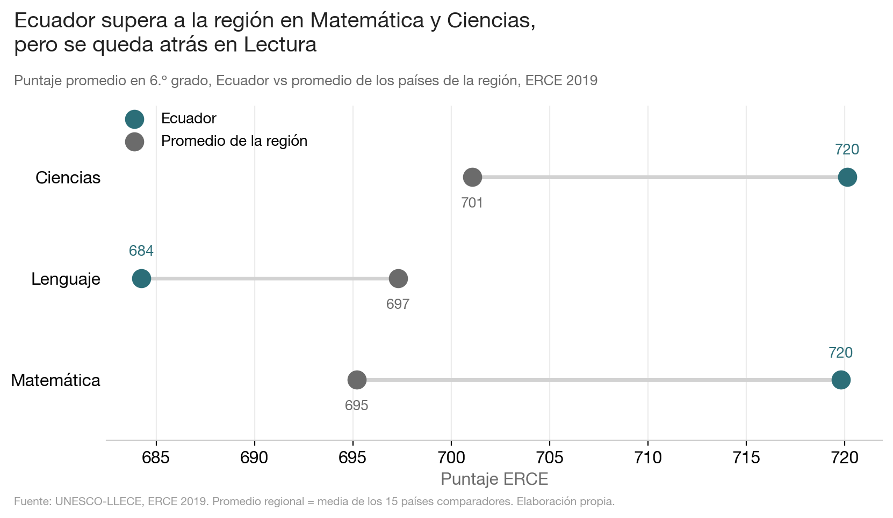
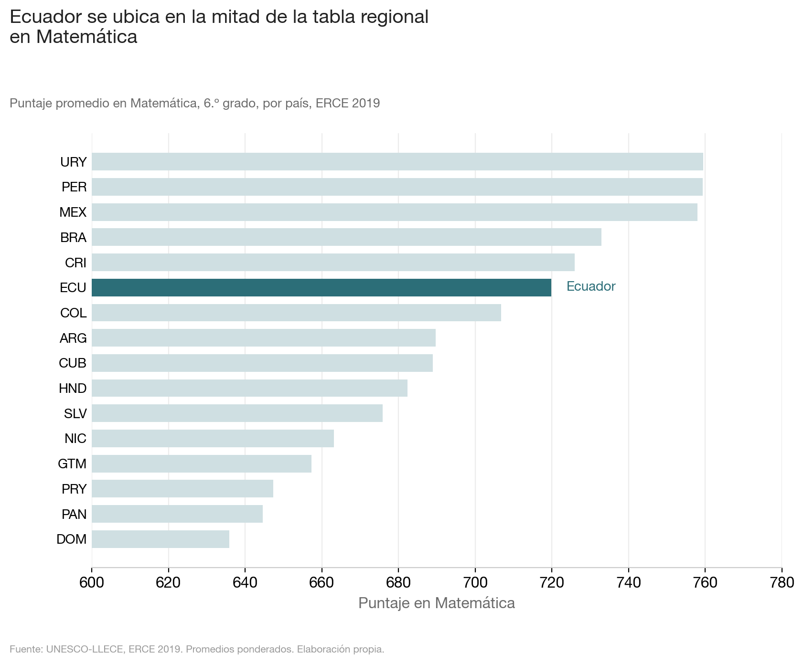
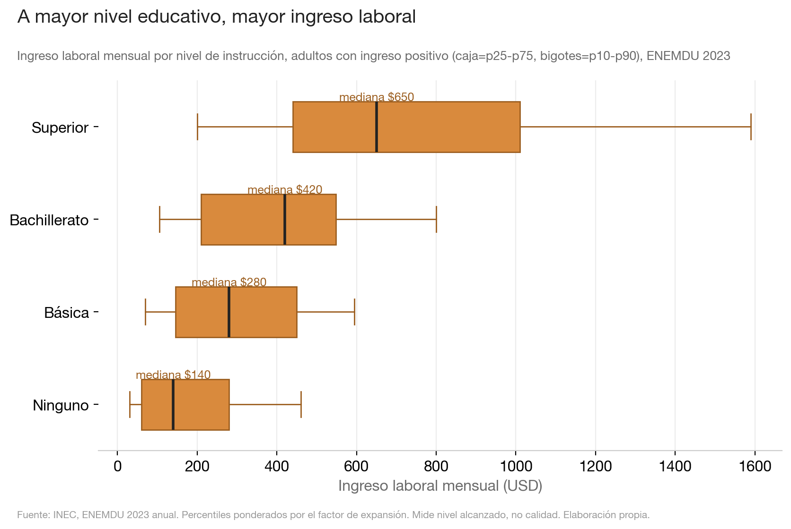
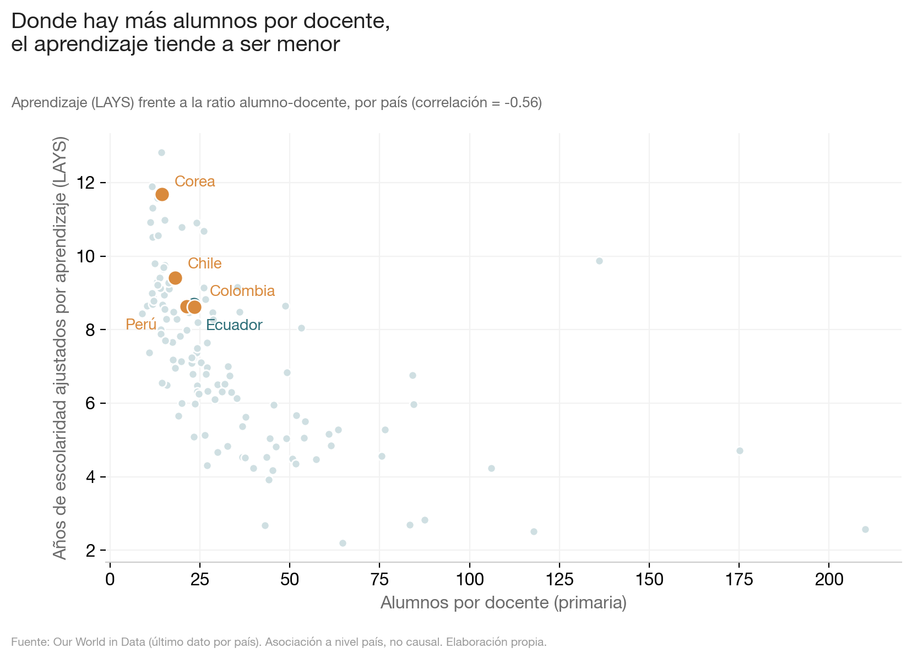
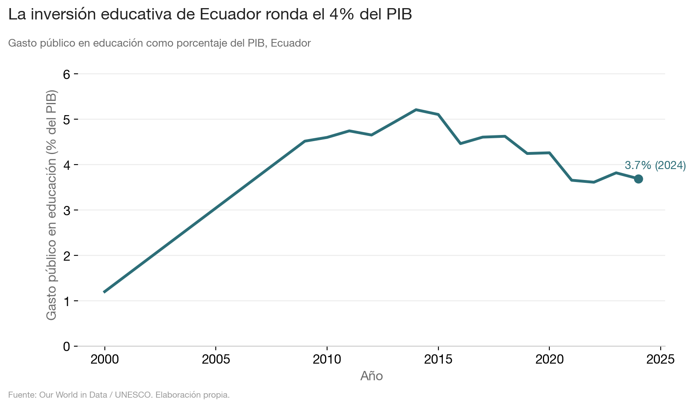
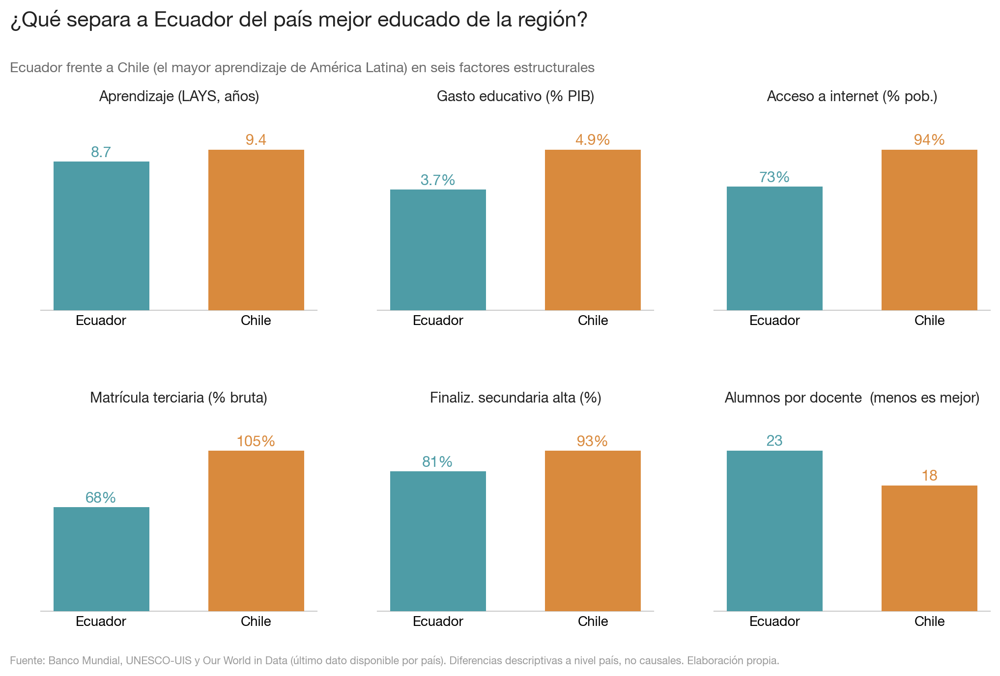

# Calidad educativa y desigualdad estructural en Ecuador

**Una visualización de datos para el concurso _Ecuador Cuantificador 2026_**

> ¿Cómo se compara la calidad de la educación de Ecuador con la de los países con mejor
> desempeño educativo, y qué diferencias estructurales explican esa brecha?

Entregable principal: [`education_ecuador_analysis.ipynb`](education_ecuador_analysis.ipynb) — un
Jupyter Notebook narrativo que explora, limpia y analiza datos oficiales de Ecuador e
internacionales, y genera ocho visualizaciones (carpeta [`figuras/`](figuras/)).

---

## El concurso

_Ecuador Cuantificador 2026_ invita a crear una **visualización original sobre Ecuador** a partir
de **datos verificables**, compartiendo los archivos necesarios para reproducir el análisis. No se
premia solo un gráfico llamativo: se busca comunicar información relevante de forma **clara,
transparente y basada en evidencia**.

## La pregunta

> **¿Qué diferencias estructurales existen entre Ecuador y los países con mejor desempeño
> educativo, y cómo se transmiten las desigualdades de origen socioeconómico a través de la
> calidad educativa hacia las oportunidades?**

## ¿Por qué esta pregunta?

La calidad de la educación, cuánto **aprenden** realmente los estudiantes, no solo cuántos años
asisten; es uno de los motores del desarrollo y de la movilidad social. En Ecuador ese aprendizaje
no se reparte de forma pareja: depende del nivel socioeconómico de la familia, del territorio y del
tipo de escuela. Entender esas desigualdades, y dónde se ubica Ecuador frente a los países que más
aprenden, es un primer paso para discutir políticas con evidencia.

## Mi enfoque

El análisis es **descriptivo y correlacional**, no causal: los datos son transversales y
observacionales, así que se identifican **patrones, asociaciones y posibles factores estructurales**,
nunca causalidad fuerte. Cuando la comparación internacional y los microdatos nacionales viven en
niveles distintos, se usa **triangulación** (varias fuentes apuntando en la misma dirección).

La exploración se organiza con tres relaciones, usadas como mapa de qué mirar:

- **R1. Origen socioeconómico - Calidad**: ¿el nivel socioeconómico de la familia se asocia con el aprendizaje?
- **R2. Educación - Oportunidades**: ¿el nivel educativo se asocia con el ingreso laboral?
- **R3. Recursos - Resultados** (a nivel país): ¿la inversión y el tamaño de las clases se asocian con el aprendizaje?

---

## Recursos de datos

Antes de analizar, se hizo una **auditoría** de todas las fuentes para decidir cuáles realmente
sirven para la pregunta. Las APIs se probaron primero (conexión, respuesta de ejemplo y columnas)
antes de programar con ellas.

### Fuentes que forman el núcleo del análisis

| Fuente | Qué otorga | Cómo ayuda |
|---|---|---|
| **INEVAL — Ser Estudiante** (2023-2024) | Microdatos por estudiante: nota por campo, índice socioeconómico, quintil, área, sostenimiento, etnia, provincia | Mide la **desigualdad interna** de Ecuador (R1) |
| **ERCE 2019** (UNESCO-LLECE) | Prueba comparable en 16 países de la región, a nivel de estudiante, con cuestionario de familia | Sitúa a Ecuador **frente a la región** y aporta educación de los padres (R1 + comparación internacional) |
| **ENEMDU 2023** (INEC) | Microdatos de hogares: nivel educativo, ingreso laboral, empleo | Relaciona **educación con ingreso/empleo** (R2) |
| **Banco Mundial** (API) | Indicadores comparables: gasto educativo, internet, matrícula terciaria | Factores estructurales a nivel país (R3 + comparación) |
| **UNESCO-UIS** (API) | Finalización por nivel, indicadores SDG4 | Acceso y trayectoria educativa comparable (R3 + comparación) |
| **Our World in Data** | LAYS (años de escolaridad ajustados por aprendizaje), gasto, ratio alumno-docente | Métrica de calidad comparable y factores de recursos (R3) |
| **SEDLAC** (CEDLAS) | Estadísticas armonizadas de hogares de América Latina | Contexto regional de retornos educativos (R2) |

### Fuentes evaluadas y descartadas (con justificación)

Por transparencia, se documentan las fuentes que se revisaron pero **no** entraron al análisis:

- **PISA 2022, TIMSS, PIRLS, OECD Data Explorer:** Ecuador no participa en estas evaluaciones, así
  que no permiten ubicarlo directamente. PISA, además, solo se descargó el cuestionario de escuela
  (sin notas de estudiantes).
- **Censo 2022 y Encuesta de Condiciones de Vida (ECV):** la ECV es de 2013-2014 (desfasada) y el
  Censo (~5 GB) excede el alcance descriptivo de estas tres relaciones; se priorizó profundidad
  sobre cantidad de datasets.
- **Ser Profesional:** sin variables explicativas (solo provincia, sexo y una nota).

---

## Qué hice (resultados)

El notebook recorre cuatro partes: **(1)** exploración y limpieza de cada fuente, **(2)** análisis
por relaciones, **(3)** visualizaciones y **(4)** validación metodológica. Las ocho figuras:

### 1. ¿Qué desigualdades pesan más en el aprendizaje?
El territorio (28.6 pts entre la mejor y peor provincia) y el origen socioeconómico (20.9 pts)
marcan las mayores brechas; el área urbano/rural por sí sola pesa poco (3.9 pts).



### 2. La ventaja socioeconómica desplaza toda la distribución
No es solo el promedio: toda la distribución de notas sube del quintil más pobre al más rico.



### 3. Ecuador frente a la región (ERCE 2019)
Ecuador supera a la región en Matemática y Ciencias, pero **se queda atrás en Lectura**.



### 4. Ecuador en la tabla regional de Matemática
Se ubica a media tabla entre los 16 países del ERCE.



### 5. Educación e ingreso (R2)
El ingreso laboral sube con el nivel educativo (mediana de $140 sin estudios a $650 con superior).



### 6. Recursos y resultados (R3)
Donde hay más alumnos por docente, el aprendizaje tiende a ser menor (correlación −0.56 a nivel país).



### 7. Inversión educativa en el tiempo
El gasto público en educación de Ecuador ronda el 4% del PIB.



### 8. Gráfico central — Ecuador frente al país mejor educado de la región
Chile (el mayor aprendizaje de América Latina por LAYS) supera a Ecuador en **todos** los factores
estructurales: aprendizaje, gasto, conectividad, acceso a la educación superior y finalización, y
tiene menos alumnos por docente.



**Narrativa:** Ecuador no solo tiene menor desempeño que los países líderes de la región, sino
también mayores desigualdades estructurales internas (socioeconómicas y territoriales). Estas
diferencias se asocian con menores oportunidades futuras (acceso a educación superior, ingreso).

---

## Estructura del repositorio

```
concurso-visualizador/
├── education_ecuador_analysis.ipynb   # Notebook principal (entregable)
├── requirements.txt                   # Dependencias de Python
├── README.md
├── figuras/                           # 8 visualizaciones exportadas (PNG)
└── data/                              # Datos (NO incluidos en el repositorio; ver abajo)
    ├── ineval-ser-estudiante/
    ├── erce-2019/sav/
    ├── enemdu/
    ├── owid/
    ├── sedlac/
    └── cuentas-satelites-servicios-educacion/
```

## Cómo reproducir

1. **Instalar dependencias** (Python 3.10+):
   ```bash
   pip install -r requirements.txt
   ```
2. **Colocar los datos.** La carpeta `data/` no se versiona en este repositorio por su tamaño
   (>1 GB) y por las licencias de cada fuente. Los archivos se entregan aparte (ZIP / enlace) con la
   estructura indicada arriba; los enlaces oficiales de descarga están en la sección _Fuentes_.
3. **Ejecutar** el notebook desde la raíz del proyecto (Run All). Las rutas son relativas a `data/`.
4. **Conexión a internet:** las celdas de Banco Mundial y UNESCO-UIS consultan sus APIs en vivo.

> Las figuras de `figuras/` ya están generadas, así que el análisis puede revisarse sin ejecutar el
> notebook. Al ejecutarlo, se regeneran automáticamente.

## Limitaciones

- **No es causal.** Todos los diseños son transversales y observacionales; se habla de asociaciones.
- Los cortes por factor están **correlacionados entre sí** (lo privado y lo urbano concentran
  familias de mayor quintil): no aíslan el efecto de cada variable.
- No se puede vincular la **nota individual** con el salario futuro; R2 mide retorno del nivel
  educativo, no de la calidad.
- **Desfase temporal** entre fuentes (ERCE 2019, INEVAL 2023-2024, ENEMDU 2023): no se cruzan años.
- Ecuador no participa en PISA/TIMSS/PIRLS; la comparación internacional usa indicadores
  armonizados (LAYS, ERCE, UIS).

## Fuentes

- INEVAL Ser Estudiante — https://www.datosabiertos.gob.ec/dataset/ser-estudiante
- ERCE 2019 (UNESCO-LLECE) — https://www.unesco.org/es/articles/estudio-regional-comparativo-y-explicativo-erce-2019
- ENEMDU (INEC) — https://anda.inec.gob.ec/anda5/index.php/catalog/1270/get-microdata
- Cuentas Satélite de Educación (INEC) — https://www.ecuadorencifras.gob.ec/cuenta-satelite-de-los-servicios-de-educacion/
- Banco Mundial (API) — https://datahelpdesk.worldbank.org/knowledgebase/articles/889392
- UNESCO-UIS (API) — https://api.uis.unesco.org/api/public/documentation/
- Our World in Data — https://ourworldindata.org/
- SEDLAC (CEDLAS) — https://www.cedlas.econo.unlp.edu.ar/wp/estadisticas/sedlac/

---

